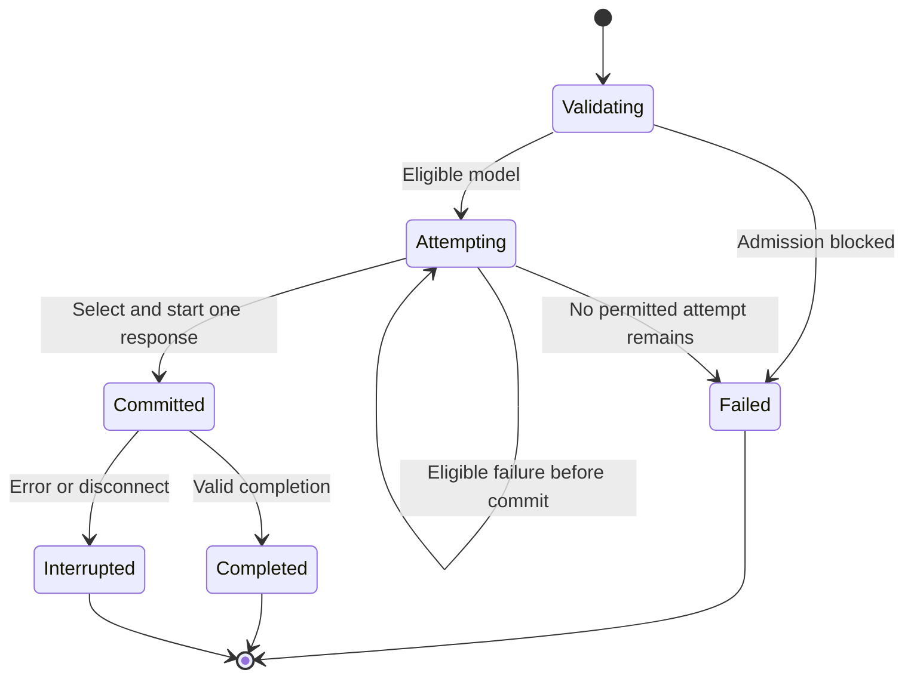

# VESSEL: Cline model fallback implementation plan

**Status, 10 September 2026:** This remains a roadmap, not a completion report. The 0.5 preview implements bounded routing profiles and conservative pre-response fallback with local transport tests. Durable funding pauses, cooldowns, capability validation, configuration UI and a live Cline gateway round trip remain pending. See `docs/verification.md` for verified results.

**AI coding-agent handoff · 9 September 2026 · Status: specification to implement**

## 1. Start building here

Implement a VESSEL inference gateway that lets a user configure a primary model and ordered fallback models, connect Cline to one VESSEL endpoint, and continue a supported inference request when its primary model becomes unavailable.

Read this entire plan and inspect the repository, including applicable `AGENTS.md` instructions and uncommitted work. Reuse existing components. Make routine engineering decisions and implement them; do not stop after producing another plan. Work through phases F0–F5 below. Start with a runnable local gateway, a deterministic fake upstream and focused tests. Missing live credentials must not block independent implementation. Record live checks as blocked until actually performed.

If the earlier VESSEL `README.md` is present, read it too. This document specifies the **Cline fallback implementation slice**. The README describes the wider continuity product. VS Code + Cline is the active client; preserve checkpoint integrity and recovery safeguards. A gateway passing requests does not automatically prove native memory capture.

All VESSEL routes, commands, aliases and configuration schemas below are interfaces to build. None is a claim that a published service already exists.

### Concrete first outcome

A user configures models A, B and C in VESSEL, then selects `vessel-auto` in Cline. During a controlled test, A fails before VESSEL commits a response to Cline. VESSEL tries eligible model B with the request's conversation and tool context. Cline receives one valid response and continues its task. The user can inspect which model answered and why it was selected.

### Deliverable boundaries

| Deliverable | Completion evidence |
| --- | --- |
| Gateway fallback MVP: F0–F5 | Ordered routing, valid streaming/tool calls, honest failure handling, configuration UI, tests and an actual Cline smoke test. |
| Continuity bridge: F6 | Selected checkpoints, current permissions, explicit task handover and verified continuation through a separately tested client adapter. |
| Later product capabilities | Hosted multi-user service, wallet authorization and supported Orbio funding/key management, each verified independently. |

Ship and report these separately. Complete F0–F5 first. Start F6 after the gateway gates pass, reusing the earlier README's continuity implementation where available. Do not describe an inference retry as restoration of an agent's full saved identity.

## 2. User experience and deployment

1. Start the local VESSEL service and enroll one workspace for the preview.
2. Connect a funded inference credential through the owner interface.
3. Create a routing profile: primary model, first fallback and optional second fallback.
4. Validate the models' availability, compatible capabilities and context limits. Show any check that could spend credits before running it.
5. Activate the profile and generate a VESSEL client credential.
6. Copy the Cline setup values, make a small test request and inspect its routing record.
7. Work in Cline. On an eligible model failure, the gateway follows the approved priority order.

The first local preview supports one owner, one enrolled workspace and one active admitted request per enrollment. This controls VESSEL admissions; it does not prove that only one native Cline conversation or background process exists.

### Intended Cline configuration

| Cline setting | Value after the local gateway is implemented |
| --- | --- |
| API Provider | `OpenAI Compatible` |
| Base URL | `http://127.0.0.1:8787/v1` for the verified local desktop setup |
| API Key | The generated VESSEL inference credential |
| Model ID | `vessel-auto` |
| Context/output limits and features | Values derived from the profile's tested compatibility envelope |

`vessel-auto` is a VESSEL routing alias, not an upstream model. Never forward it unchanged to Orbio. Cline documents a custom base URL, API key, model ID and model configuration fields; verify the exact installed version accepts the alias and returned actual model identity. [Cline custom-provider documentation](https://docs.cline.bot/provider-config/openai-compatible)

Test where the extension makes network requests. The loopback address works only when the gateway is reachable from that extension host. Remote SSH, WSL and containers may have a different host. Document the tested connection; do not expose a local service publicly to work around an unexplained connectivity issue.

Plan/Act mode selection does not configure the fallback chain. Both modes may use `vessel-auto` initially. Multiple aliases for different tasks can follow after one profile works.

### Upstream credential routes

| Verified credential route | Upstream base URL |
| --- | --- |
| Orbio gateway credential | `https://api.orbio.so/api/v1` |
| Direct funded OpenRouter credential, if that is what the account issued | `https://openrouter.ai/api/v1` |

Use the actual account instructions to identify the route; the key prefix is a hint, not an authentication test. Orbio currently publishes the first endpoint with its `sk-orbio-…` key. Older notes using the website host must be rechecked. [Orbio API configuration](https://www.orbio.so/)

Implement one explicitly selected upstream route per profile. Switching models behind the same broken gateway or exhausted account does not restore access. Cross-gateway redundancy is outside the initial scope.

## 3. Architecture and implementation choices

Use Python with FastAPI, Pydantic, HTTPX and SQLite for the local service. Reuse an existing React frontend; otherwise build a small React/TypeScript settings interface after the backend works. Choose supported versions when implementing and commit a reproducible lockfile. Keep domain logic independent of HTTP handlers.

| Component | Responsibility |
| --- | --- |
| Inference API | Authenticate the VESSEL client, validate the alias/request, admit work and return a compatible response. |
| Profile service | Store ordered models, capability evidence, current owner-approved policy and revisions. |
| Router | Select eligible candidates, classify failures, enforce attempt/deadline limits and control response commitment. |
| Upstream adapter | Translate verified protocol details, stream responses, classify provider-specific errors and normalize usage. |
| Credential store | Keep upstream secrets out of project files, logs, checkpoints and the model's tools. |
| Request ledger | Record requests, attempts, selected models, uncertainty and usage metadata. |
| Owner CLI/UI | Configure and activate profiles, reconnect credentials, inspect failures and pause/resume admission. |
| Continuity bridge | Later connect a failed request to a verified run/checkpoint, without guessing session identity. |

Use one reusable async HTTP client with bounded connections. Keep each upstream response open while forwarding it, and close it on every completion, cancellation and error path. Disable hidden transport/SDK retries so one router controls the attempt count. [HTTPX async streaming and cleanup](https://www.python-httpx.org/async/)

Start as one local process and one database, with a single-instance lock. Do not introduce Redis, a message broker, Kubernetes or separate services for this preview. Moving to multiple workers later requires shared admission, policy and cooldown state.

Suggested files, adapting to the existing repository:

| Path | Contents |
| --- | --- |
| `services/gateway/app.py` | Startup, dependency wiring, lifecycle and routes. |
| `services/gateway/api/inference.py` | `/v1/models` and `/v1/chat/completions`. |
| `services/gateway/api/control.py` | Owner-scoped profiles, credentials and status. |
| `packages/vessel_core/routing/` | Schemas, policy, candidate selection, failure classification and routing state machine. |
| `packages/vessel_core/providers/` | Chat Completions adapters and capability registry. |
| `packages/vessel_core/storage/` | SQLite migrations, request/attempt records and durable pause state. |
| `packages/vessel_core/secrets/` | Secret-store abstraction and platform implementation. |
| `apps/dashboard/` | Minimal configuration and request-inspection UI. |
| `tests/fixtures/` | Sanitized Cline payloads and fake upstream scenarios. |
| `docs/` | Setup, compatibility evidence, limitations and demo results. |

## 4. Configuration, state and authority

### Profile schema

Implement strict validation with versioned migrations. This example is a **draft profile**, not a prevalidated working model combination. Replace or validate model IDs and capabilities before activation.

```json
{
  "schema_version": 1,
  "profile_id": "profile_default",
  "alias": "vessel-auto",
  "revision": 1,
  "status": "draft",
  "upstream": {
    "kind": "orbio_gateway",
    "base_url": "https://api.orbio.so/api/v1",
    "credential_ref": "secret://orbio/main"
  },
  "model_order": [
    "anthropic/claude-sonnet-5",
    "google/gemini-3.8-flash",
    "deepseek/deepseek-v4-pro-0813"
  ],
  "policy": {
    "max_attempts_per_request": 3,
    "max_attempts_per_model": 1,
    "connect_timeout_seconds": 10,
    "first_event_timeout_seconds": 60,
    "stream_idle_timeout_seconds": 60,
    "request_deadline_seconds": 300,
    "model_cooldown_seconds": 30,
    "retry_ambiguous_timeouts": false,
    "fallback_after_commit": false,
    "auto_return_to_primary_on_next_request": true
  }
}
```

Those model IDs appear in Orbio's public catalogue at research time. Availability, request compatibility and account access must still be tested. Do not hard-code current prices or infer model features from names. [Orbio catalogue](https://www.orbio.so/)

Reject duplicate/empty lists, more than three candidates for the MVP, duplicate aliases, unsupported upstream hosts and invalid limits. Attempts include the primary call; three models do not mean three retries for each model. Keep real credentials out of this JSON.

Provide a separately labeled fixture profile and injected fake adapter for development without a live key. It must not require a real Orbio credential or relax the live upstream-host restrictions. Synthetic model capabilities validate fixture behavior only.

### Required records

| Record | Minimum fields |
| --- | --- |
| Profile | Owner/enrollment, alias, revision, ordered candidates, policy, draft/active state and validation evidence. |
| Capability record | Route/model, context/output bounds, accepted parameters, tool/vision/structured-output support, metadata source and tested time. |
| Credential slot | Provider kind, opaque secret reference, monotonic version and active/invalid status. |
| Client credential | Token hash, owner/enrollment, permitted profile, revocation state and execution-epoch binding when continuity is implemented. |
| Request | Generated ID, profile/revision, attribution level, start/end, terminal status and optional verified run ID. |
| Attempt | Request ID, ordinal, requested/reported model, credential version, upstream receipt ID, outcome, timing, usage and cost confidence. |
| Admission state | Owner/enrollment, active request, pause reason, cooldown scope and earliest allowed retry time. |
| Owner audit event | Actor, changed revision, operation and timestamp; no secrets. |

Assign identifiers and ownership in trusted code. With no proven Cline conversation correlation, leave `run_id` unset and report credential/enrollment attribution. Do not infer a run from timing, prompt similarity or a model-supplied ID.

Use SQLite transactions for profile activation, admission slots and state transitions. Store the attempted dispatch before sending upstream; record the outcome afterward. A crash in between leaves an uncertain attempt and must not trigger automatic replay on restart. Use tested durable database settings, bounded retention and a consistent backup path.

Profiles and routing permissions are owner-controlled. The inference token cannot edit them. Freeze the candidate order for a request, but revalidate current authorization, revocations and credential version before every dispatch. If policy changes during the request, stop/revalidate rather than continue under revoked authority. Future requests use the new profile revision.

## 5. API and CLI contracts

### Inference API

| Endpoint | Contract |
| --- | --- |
| `GET /healthz` | Minimal liveness only, without account or secret data. |
| `GET /v1/models` | Authenticated OpenAI-compatible list of aliases permitted to this credential. |
| `POST /v1/chat/completions` | Authenticated `model`, `messages`, supported tool fields and optional `stream`; gateway selects one approved upstream model per attempt. |

Implement text Chat Completions first, supporting both non-streaming and SSE responses. Preserve message roles, ordering, tool results, tool-call IDs and parameters needed by the observed Cline requests. Begin with `n = 1`. Reject unsupported endpoints/features explicitly. The gateway must never execute generated tool calls itself.

Use an allowlist of supported fields with validated adapter mappings. Do not silently discard an instruction, tool schema or required response-format constraint. Reject client-supplied upstream URLs, raw unapproved model IDs and routing overrides such as `models`/`fallbacks`. Only the owner policy chooses the chain.

Return a generated request ID in `X-Vessel-Request-Id`. After a model is selected, expose the actual reported upstream model and selection reason in the request ledger. Preserve actual model identity in compatible response fields instead of claiming the alias is the model that answered. Verify Cline tolerates this in F1. Unknown usage remains unknown.

Before response commitment, return a consistent JSON error envelope:

```json
{
  "error": {
    "type": "vessel_gateway_error",
    "code": "upstream_credentials_required",
    "message": "Reconnect the upstream credential in VESSEL.",
    "request_id": "req_example",
    "retryable": false
  }
}
```

Use `401` for an invalid VESSEL client token. Use `400` for invalid input, `413` for excessive body size, `402` for confirmed unavailable funding, `429` for scoped throttling, `503` for exhausted/unavailable upstream access and `504` for a deadline exceeded before commitment. Distinguish upstream credential failure with its own code, so users are not instructed to replace a valid VESSEL token. Keep raw provider messages sanitized.

### Owner controls

Implement separate authenticated control routes under `/control/v1`. The inference credential must receive a denial on every privileged route.

| Operation | Suggested route |
| --- | --- |
| Create/list profiles | `POST/GET /control/v1/profiles` |
| Read/update profile | `GET/PATCH /control/v1/profiles/{id}`; updates require `expected_revision`. |
| Validate/activate | `POST /control/v1/profiles/{id}/validate` and `/activate`; validation records local versus live checks. |
| Set/replace upstream key | `POST /control/v1/credentials`; accept a secret once, return metadata only. |
| Issue/revoke client token | `POST /control/v1/client-credentials` and `POST /control/v1/client-credentials/{id}/revoke`. |
| Pause/revalidate/resume | `POST /control/v1/profiles/{id}/pause` and `/resume`; never clear a blocker without its required check. |
| Inspect attempts | `GET /control/v1/requests` and `GET /control/v1/requests/{id}`. |

Provide matching CLI commands before the UI: `vessel init`, `vessel credential set`, `vessel profile validate`, `vessel profile activate`, `vessel token create`, `vessel serve`, `vessel status` and `vessel requests`. Document their actual implemented flags. Use hidden credential input, not command-line secrets recorded in shell history. No wallet seed phrase is needed.

## 6. Routing algorithm and failure policy

The first implementation owns fallback in VESSEL and sends a single real `model` per upstream attempt. OpenRouter documents an ordered `models` array, but Orbio support for that extension remains unverified. Avoid combining VESSEL retries with an unknown upstream model chain. Existing upstream provider routing for the same model must be reported only to the extent it is observable. [OpenRouter model fallbacks](https://openrouter.ai/docs/guides/routing/model-fallbacks)

### Request algorithm

1. Authenticate; resolve the credential's allowed alias/profile. Validate body size, fields and required model capabilities before paid work.
2. Check current authorization, profile state, upstream pause/cooldown and admission slot. Create a request record and a fixed deadline using a monotonic clock.
3. Traverse the approved model order. Skip incompatible, revoked or still-cooled-down candidates with a recorded reason. An unattempted skip does not consume an upstream attempt, but traversal is bounded by the finite list.
4. Revalidate current controls, record the next attempt and prepare the same logical conversation/tool context using the verified adapter mapping. Do not silently summarize or trim the task to fit another model.
5. Send one upstream request with remaining deadline and attempt limits. Parse status and, for streaming, prefetch enough to detect an initial error before committing to Cline.
6. On a permitted failure before commitment, close that response, update the scoped failure state and try the next eligible candidate. Do not run speculative parallel attempts.
7. On a valid response, commit one attempt to Cline and forward only that attempt. Once committed, never change models within that response.
8. Record completion, interruption, cancellation or final failure. Reconcile available usage and release the local admission slot in all paths. Never turn missing receipts into proof of zero cost.

### Explicit classifier

The table below is VESSEL's policy. Provider-specific codes/scopes require verification; a bare status code is not always enough to determine scope.

| Condition | Required behavior |
| --- | --- |
| Confirmed model/provider unavailability before commitment | Try the next eligible model within the attempt/deadline limits. |
| Confirmed model-scoped `429` | Respect that model's retry time and try a different eligible model. |
| Account/gateway-wide `429`, or unknown rate-limit scope | Pause that route until its retry time; do not try every model through the same limited account. |
| Upstream authentication failure | Persist `needs_credentials`; stop attempts and require independently authorized reconnection. A rejection alone is not proof of compromise. |
| Confirmed insufficient account credits | Persist `needs_funding`; stop paid attempts. A cheaper model does not fix zero shared credits. |
| Gateway DNS/connectivity failure or known route-wide outage | Pause/cool down the route. Changing a model ID cannot repair the same unavailable gateway. |
| Invalid input, unsupported parameter or unknown error scope | Return a specific error; do not mask implementation/configuration errors with repeated paid attempts. |
| Context/capability mismatch | Skip a candidate only when the same request is valid on another approved model; otherwise fail preflight. Never drop required context or tools. |
| Refusal or content-filter result | Preserve the result; do not use fallback to bypass it. |
| Timeout with uncertain upstream acceptance or billing | Default to terminal `uncertain_timeout`. An explicit future policy may permit bounded retries with the cost uncertainty disclosed. |
| Client disconnect/cancel | Close upstream work, stop the chain and record cancellation. Closure is not proof that provider billing stopped. |
| Any failure after commitment | Mark `stream_interrupted`; emit the verified compatible error termination when possible and end the response. No alternate model is spliced in. |

`Retry-After`, when present and applicable, takes precedence over the ordinary cooldown. Do not shorten it to force a retry. If waiting exceeds the request deadline, return the blocked state. Use injectable clocks in tests; no unbounded sleeps or polling.

Cooldowns must have the correct scope: model+credential+route for a model failure, credential/account for account limits, and route for gateway failure. Persist account pauses so Cline's own retries cannot repeatedly spend or bypass them. Default to trying the primary again on a later request only after its cooldown expires; do not change back halfway through a response.

## 7. Streaming and model compatibility

### Response commitment is the fallback boundary

Implement explicit states rather than retrying inside an already-started response generator:



Prefetch the upstream HTTP result and first valid non-error SSE data event before returning the downstream streaming response. Buffer bounded upstream comments/prelude; do not forward heartbeats that prematurely start the downstream response. Conservatively treat the first attempt to send downstream response headers/body as committed. An uncertain network write is not permission to switch models.

An upstream `200` is insufficient proof of success: its first SSE data event may contain an error. OpenRouter also documents SSE comments and errors carried inside an already committed stream. Parse event framing and error payloads, not just status codes or individual TCP chunks. Validate equivalent behavior through the actual Orbio route. [OpenRouter streaming contract](https://openrouter.ai/docs/api_reference/streaming)

Preserve UTF-8 boundaries, multi-line SSE data, tool-call indices/IDs/argument fragments, finish reasons and usage frames. Handle both empty `choices` accounting chunks and content-free usage chunks. Do not interpret a repeated finish reason in a usage frame as a second completion. Do not persist hidden reasoning fields as portable agent memory.

After commitment, no retry is allowed for malformed data, timeout or an upstream error. Use a tested Cline-compatible error termination; never manufacture a successful completion marker. If the installed Cline version cannot display that error reliably, report the compatibility limitation and block a claim of verified failure handling.

### Capability envelope

The alias exposes one tested request contract. Derive Cline's configured context/output limits and enabled features from the supported intersection of its eligible models. Keep enough space for tool schemas, wrapper overhead and output; do not invent exact limits when provider metadata is unavailable.

For each actual request, additionally check whether every candidate can accept its content types, tool protocol, output format and parameters. A model unable to serve that request is not a working fallback. Preserve a complete tool-call/result pair and approved instructions when moving between models. Provider-specific reasoning state, signed blocks or parameters require a documented conversion or make the candidate ineligible.

Start with text plus the verified Cline tool protocol. Add images, reasoning options and structured-output modes only after testing them. Disable unsupported Cline features for that profile rather than advertise them based on one candidate's capabilities.

## 8. Credentials, spending, privacy and resource limits

Store upstream keys in an OS credential store for the local preview. Keep the owner-control secret separate from the inference token. Hash high-entropy VESSEL tokens for lookup; return a newly issued raw token once. Keep secrets out of telemetry, frontend persistence, project snapshots and exports. Document the same-OS-user trust boundary; this is not a sandbox against the owner's local administrator.

Bind the service to loopback by default. Authenticate inference and controls even locally. Validate Host/Origin where relevant, restrict browser access to the owned UI origin and avoid wildcard CORS. Restrict upstream hosts and redirects so credentials cannot be forwarded to arbitrary destinations. Public hosting requires TLS and appropriate account isolation before exposure.

An upstream key may be replaced behind the same VESSEL credential within an execution epoch. Update its secret reference/version atomically; no new dispatch may use a revoked version. In-flight requests remain uncertain until reconciled. A compromised VESSEL credential must itself be revoked/reissued. Automatic Orbio claiming, rotation and top-up are excluded until its supported management access is verified; manual owner reconnection is required in the MVP.

Record observed token usage and cost per attempt when available, plus the upstream receipt/source and observation time. Track estimated, reported and unknown values separately. Do not label Cline's static price calculation as actual discounted Orbio billing. Missing usage after failure is not zero usage. Usage outside VESSEL is outside its enforcement boundary.

For the first release, provide spending observations and explicitly labeled soft pause thresholds. Do not claim a hard currency cap without verified maximum-cost reservations, concurrency control and reconciliation. Spending/pause/credential state is authoritative control data; restoring an old agent checkpoint must never replenish it.

Initial configurable limits, to measure and revise with evidence:

| Resource | Default |
| --- | --- |
| Candidates / attempts | Up to 3 distinct models; up to 3 total attempts and 1 per model. |
| Active admission | 1 request per enrollment; reject excess work with a clear retryable busy response. |
| Request body | 8 MiB, enforced while reading, with bounded collection/string sizes. |
| SSE prelude / individual event | 1 MiB prelude and 256 KiB per event; reject overflow visibly. |
| Time | Profile's bounded connect, first-event, idle and whole-request deadlines. |
| Ledger retention | 7 days or 10,000 terminal requests, whichever reaches its ordinary limit first; pin unresolved billing/continuity evidence. |
| Local storage | 1 GiB preview budget with headroom; stop new paid admission if required ledger writes fail or pinned data exhausts capacity. |

Do not log prompts or completions by default. Keep the in-flight request in memory for its bounded lifetime. Any later encrypted checkpoint storage belongs to the owner's explicit continuity configuration. Use redacted fixtures for debugging.

No automatic replay after a gateway crash. Restore profile/pause state, mark dispatched-but-unfinished attempts uncertain and close stale local admission slots only through reconciliation. Use SQLite's Online Backup API for a consistent database copy; do not independently copy a live database and WAL. Coordinate the copy with referenced companion artifact manifests when F6 exists. [SQLite backup API](https://www.sqlite.org/backup.html)

Opening a restored historical backup is different from restarting the current database: begin in `restore_pending` with paid admission disabled and imported client credentials inactive. Require fresh owner enrollment/authorization, new client credentials and reconciliation against available current funding/control records before resuming. Treat usage newer than the backup as unknown, not zero; if current authority or required spending state cannot be established, keep managed admission blocked and allow history inspection. Never silently reactivate a backup's old tokens or permissions.

If the client supplies a verified idempotency key, scope it to the owner and payload digest: conflicting reuse is rejected, in-flight duplicates do not dispatch twice, and completed requests return a terminal status unless a separately designed secure replay cache exists. If Cline supplies no stable key, record a new ingress request; do not guess duplicates from identical prompts. Global pause/cooldown state still limits repeated failures.

## 9. Minimal owner interface

Build only the surfaces needed to configure and demonstrate the behavior:

| Surface | Required actions and evidence |
| --- | --- |
| Upstream connection | Choose route, enter/replace key, see validation and funding observation status. |
| Routing profile | Select and reorder 2–3 models, view compatibility blockers, validate and activate a revision. |
| Connect Cline | Copy the generated endpoint/alias/client token and the tested capability settings. |
| Request history | Show requested alias, attempted/reported models, switching reason, response outcome and known/unknown cost. |
| Recovery attention | Explain `needs_credentials`, `needs_funding`, cooldown, uncertain timeout or stream interruption and the appropriate next action. |

Show gateway-request status separately from companion/checkpoint status. Model fallback must not turn the UI green with “Agent restored” unless a real continuation check passed. Reordering models must require owner access and persist across restart. Never offer a model-editable tool that changes its own route or spending permissions.

## 10. Build phases and gates

### F0 — Inspect and capture the integration contract

- Inspect repository instructions, existing VESSEL code and local platform requirements.
- Establish the package, test runner, fake upstream and minimal `/healthz` service.
- Inspect the installed Cline custom-provider settings and capture sanitized request fixtures using the local fake endpoint.
- Verify request origin, alias acceptance, actual model response fields and which tool protocol Cline uses.
- Record Orbio/OpenRouter route checks separately; a missing funded credential leaves live verification blocked.

**Gate:** reproducible local setup and an explicit compatibility checklist. If Cline rejects the proposed alias, investigate a verified owner-approved mapping from its selected real model ID to the profile; do not report alias support or silently change clients.

### F1 — Forward one model correctly

- Implement client authentication, the secret-store adapter and one active profile.
- Implement `/v1/models` and single-model Chat Completions with non-streaming and streaming responses.
- Preserve the observed Cline request/tool protocol and clean up every upstream connection.
- Record actual request/attempt metadata without prompt or key logging.

**Gate:** a real Cline session can make a small request, perform an approved harmless workspace operation and continue after its tool result through VESSEL. When live access is unavailable, pass fixtures and explicitly leave this live gate pending.

### F2 — Implement ordered fallback

- Add strict profile/capability validation, per-request candidate order and current-policy checks.
- Implement the failure table, response commitment state machine, deadlines and bounded attempts.
- Add model/account/route cooldowns and durable credential/funding pauses.
- Test failure-before-response, early SSE errors and failure-after-commit independently.

**Gate:** the fake primary fails, the next compatible candidate answers, and Cline receives exactly one selected attempt. No fallback occurs on a shared key/funding failure or after commitment.

### F3 — Add owner controls and operational durability

- Implement the owner CLI and control routes, revision-safe profile edits, token issuance/revocation and manual upstream-key replacement.
- Persist profiles, attempts, paused state and reconciliation records across restart.
- Add bounded retention, backup/restore, redaction, admission controls and the resource limits.
- Measure latency added before commitment, fallback time and actual/unknown inference usage.

**Gate:** owner actions work; inference credentials cannot perform them. A restart or repeated Cline retry does not clear a pause, resurrect a revoked key or silently replay a dispatched request.

### F4 — Build the configuration UI

- Implement the five surfaces in section 9 against real backend endpoints.
- Support selecting/reordering the actual primary and fallback models; persist and revalidate changes.
- Provide copyable Cline settings and clear validation/error messages.

**Gate:** the user can configure and activate a fallback chain, connect Cline and inspect a request without editing source code. No static fake status is presented as live telemetry.

### F5 — Demonstrate and package the fallback MVP

- Run the acceptance tests below and the actual Cline smoke test on the supported Windows setup.
- Record the Cline/VS Code versions, route, models, capabilities and remaining limitations.
- Complete the demo script and provide reproducible startup/shutdown instructions, safe `.env.example`, lockfiles and actual test results.
- Keep test-failure injection confined to a fake upstream or explicitly enabled local development adapter; never ship a public unauthenticated failure switch.

**Gate:** another developer can reproduce the demo, distinguish simulation from live provider behavior and see which model answered. All F0–F5 implemented features have evidence; unavailable live checks remain visibly incomplete.

### F6 — Connect fallback to VESSEL continuity

Proceed after the gateway MVP passes. Reuse the earlier README's checkpoint, ownership and recovery contracts. Verify Cline's own supported capture/MCP mechanisms; Another client's hook names and payloads cannot be reused by assumption. The Cline hooks page did not provide a usable event contract during this research, so native automatic capture remains an integration question. [Cline hooks documentation](https://docs.cline.bot/customization/hooks)

Implement a narrow bridge with `record_inference_outcome`, `get_bound_run`, `request_checkpoint` and `prepare_handover` interfaces. A failure event alone may update gateway status; it may request a task checkpoint only through an authenticated, verified run binding. Without correlation, require owner selection and keep gateway events enrollment-scoped.

For task recovery, require immutable committed state/artifact manifests, current owner policy, destination environment/context preflight, reconciliation of uncertain effects, explicit old-task shutdown and a new transactional lease epoch. Reject stale-epoch VESSEL mutations; native tools outside those boundaries still require shutdown evidence. Never automatically replay a shell command or external write from a checkpoint.

Use a selected read-only MCP handover if automatic native capture/delivery is unavailable. Authenticate the destination binding outside model-supplied IDs. Distinguish checkpoint committed, context served, task resumed and mission completed. Validate encrypted backup plus separately recoverable keys before claiming recovery after machine loss.

**Gate:** after a supported interruption, a bound destination receives the selected saved mission/unfinished work and performs a verified intended continuation under current permissions. A gateway-only demonstration does not satisfy this gate.

## 11. Focused acceptance tests

Use deterministic fake upstreams for faults and record real client checks separately. Build tests alongside their phase, not as a promise to add them afterward.

| ID | Scenario | Required result |
| --- | --- | --- |
| T01 | Primary succeeds | One upstream attempt; returned/reported model and usage recorded correctly. |
| T02 | Primary unavailable, fallback succeeds | Correct order; same logical conversation/tools; one selected response. |
| T03 | First two unavailable | Third candidate attempted once; total attempts never exceed policy. |
| T04 | All candidates unavailable | One clear terminal error; no cycling back through the list. |
| T05 | Upstream key rejected | `needs_credentials`; no different-model retry through that key; later ingress cannot bypass pause. |
| T06 | Confirmed exhausted credits | `needs_funding`; no paid retry loop and no automatic unapproved top-up. |
| T07 | Scoped versus unscoped rate limit | Model-only failure can skip to another model; account/unknown scope respects route pause and retry time. |
| T08 | HTTP 200 containing initial SSE error | Error detected before commitment; eligible fallback still works. |
| T09 | Failure after headers/body commitment | Stream ends as interrupted; no second model data, even if the first frame had no text. |
| T10 | SSE/tool-call fragmentation | Split UTF-8, comments, multi-line events, tool argument fragments and usage-only chunks preserve semantics. |
| T11 | Client cancels | No further candidates; response/client resources close; uncertain cost stays visible. |
| T12 | Ambiguous timeout | Default stops with uncertainty; no automatic duplicate paid attempt. |
| T13 | Incompatible fallback | Context/tool/format incompatibility blocks or skips it without stripping requirements. |
| T14 | Policy changes before next dispatch | Revoked permission/model/key cannot be used under the old request snapshot. |
| T15 | Invalid VESSEL token or cross-owner lookup | Denied before upstream dispatch; no metadata/control access. |
| T16 | Inference token invokes owner control | Denied; cannot reorder models, replace keys, issue tokens or resume funding. |
| T17 | Crash after dispatch, before outcome write | Uncertain attempt survives restart; no automatic replay or reset of authoritative spend/pause state. |
| T18 | Repeated client attempts/idempotency | Scoped stable IDs prevent duplicate dispatch; without them, no guessed deduplication and durable pauses remain effective. |
| T19 | Concurrent admissions / full disk / oversized event | Bounded resources, clear errors and no paid request without required durable admission records. |
| T20 | Key replacement and token revocation | New requests use the new upstream version; revoked VESSEL credentials fail; unresolved in-flight work is reported honestly. |
| T21 | UI reorder and revision conflict | Owner's new order survives restart; stale edits cannot overwrite newer policy. |
| T22 | Privacy and host restrictions | Keys/prompts absent from normal logs; arbitrary upstream URLs, unsafe redirects and unauthorized control origins rejected. |
| T23 | Actual Cline round trip | Tested alias/response identity, streaming, approved tool call and next request work in the installed version. |
| T24 | F6 continuity handover | Correct checkpoint/destination/current policy; no stale-epoch write or external-action replay; actual continuation evidence required. |
| T25 | Consistent backup and restore | Committed profile/ledger data survives a backup made with active WAL writes; restoring historical data cannot reactivate revoked live authority or reset reconciled spending. |

## 12. Demonstration script

1. Open a small FastAPI project in Cline. Set a bounded task such as adding and testing `/health`.
2. Configure two verified compatible models in VESSEL, with an optional third. Select `vessel-auto` in Cline.
3. Make a successful request through the primary and show its request/attempt record.
4. In the isolated demo setup, inject a primary-only availability error **before** response commitment. Show the simulation label.
5. Repeat a task request. Show the failed primary attempt, chosen fallback, valid response and continued Cline tool interaction.
6. Run the project's acceptance test and show the resulting file change. Cline's native continuation here is not a claim of checkpoint restoration.
7. Separately inject an invalid upstream-key response and show `needs_credentials` with no model loop. Reconnect using a valid owner-authorized key and retry after revalidation.
8. Demonstrate a stream interrupted after commitment and show that VESSEL stops instead of splicing output.
9. If F6 is complete, perform a separate explicit checkpoint handover and verify the unfinished task's next step.

Record observed timings and actual/unknown costs. Do not call a simulated outage a real Orbio outage, or call a local policy pause actual balance exhaustion.

## 13. Required final report from the implementing AI

Return the implemented files, reproducible commands, test results and remaining blockers. Include a feature-status table for routing, streaming, key reconnection, funding observations, native Cline compatibility and checkpoint recovery. State which models/routes were actually tested and where manual owner action remains necessary.

If a live service is unavailable, finish all useful local implementation and deterministic verification. Do not fabricate credentials, funding, provider capabilities or successful smoke tests. Ask only for the specific missing access or decision needed for the blocked gate.

**First implementation task: inspect the repository, create the minimal runnable gateway and fake upstream, then make one Cline-compatible model response work before adding the fallback loop.**
